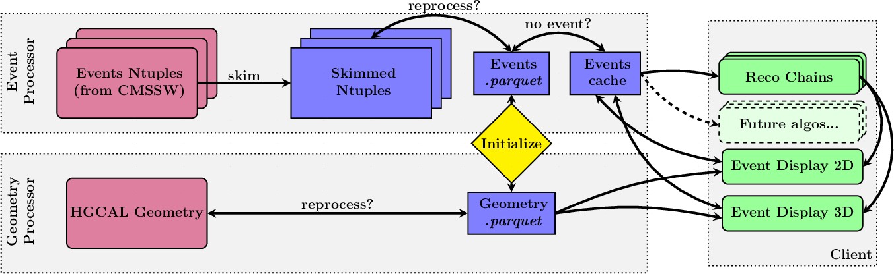

.. _data_handling:

Data Handling
****************

This section refers to the ``bye_splits/data_handle`` directory. It includes the definition and functionality of event and geometry data, within appropriate classes, both inheriting form the same base class. Additional helper functions are also included.

		   
   Code dataflow structure.
   At an initial stage, event and geometry data are separately processed.
   A "cache" system is put in place to minimize expensive reads from file.
   The two data sources are combined to provide a basis for all algorithms, which can be exploited and extended by the user ("client").

.. _event_data:

Event data
============

Implemented in ``data_handle/event.py``, in the ``EventData`` class.

The core idea is to provide event-related data as fast as possible while minimizing the number of events to be loaded at any given time.
For an algorithm where one knows in advance which events will be processes, one wants to load as many events as possible at once.
However, for an interactive event display (see :ref:`plots`), one does not know in advance which specific events will be needed, and loading all might not be feasible, or fast.
Thus, a simple system was set in place which detects whether a new event being requested has been requested before, reading it from the input file only if it is being requested for the first time.
Events to load at start can be specifically mentioned via the ``default_events`` argument.

By inspecting the ``provide()`` and ``store()`` functions, one should get a good idea on how the overall structure works.

.. note::
   
   Some ``EventData`` methods differ in their name by a single "s".
   This singular/plural difference aims at promoting code reuse as much as possible, while providing a set of convenience functions for the user, which can process one or mor events using a (hopefully) clear syntax.
   See for instance ``provide_event()`` and ``provide_events()``.

   
Geometry data
=============

Implemented in ``data_handle/geometry.py``, in the ``GeometryData`` class.

It aims to mimic the official CMSSW HGCAL geometry, originally implemented in ``C++``.
Since it is conceived to be used for visualization only, only *topological* information is processed, while all (extremely complex) details on physics simulations are not present.
Even the shapes are considered in a simplified manner; the result should **not** be seen as a replacement to the original geometry.
The goal is to provide a reasonable hand-wavy visualization of what an algorithm is doing, potentiating faster algorithmic developments.

The geometry encodes the location of all TCs, silicon modules and scintillator tiles.
It has been validated with respect to the CMSSW implementation.
TCs have a fixed diamond shape for the silicon section, and a variable-sized annular-wedge shape for the scintillator section.
`This PR <https://github.com/LLRCMS/bye_splits/pull/26>`_ provides a good discussion on both shapes. `This one <https://github.com/LLRCMS/bye_splits/pull/8>`_ instead discusses a compromise on the positioning of silicon TCs, given the fact that real TCs can have varying shapes.

.. warning::
   
   The TPG was developed with more than one geometry definition in mind.
   This repository mimics the TPG geometry at the time of its development.
   It is thus possible that future geometries might introduce differences.
   As an example, `this <https://github.com/LLRCMS/bye_splits/blob/main/bye_splits/plot/info.org>`_ was the employed definition of the *u* and *v* module indices.

For the CE-E, the cells are drawn using the ``_display_silicon_tcs()`` method, while for the CE-H I used the ``_display_scintillator_tcs()`` method.
The ``provide()`` and ``store()`` follows the same mechanism as in in :ref:`event_data`.

Other utilities
====================

The ``InputData`` in ``data_handle/data_input.py`` class serves as a convenient data type, used only within ``data_handle/``.
The ``data_handle/data_process.py`` file instead stores functions that are used by the :ref:`tasks` or :ref:`scripts`.

The ``baseline_selection()`` provides an example on how to merge the generator information with cluster information, the latter referring to the clusters already formed by CMSSW, using its default reconstruction chain (mimicked by ``scripts/run_default_chain.py``).
For an example of how it is used, see the ``tasks/fill.py`` task.
The function should be used for the first task of any "chain of tasks", as executed by a script (see :ref:`scripts` for details).

.. note::
   
   The ``baseline_selection()`` function includes some "cluster-split-centered" options.
   Future studies are welcome to add similar functions for different needs.

An example on how to use the ``EventData`` class is provided in ``get_data_reco_chain_start()``, which returns the three datasets of interest to the reconstruction chain: TCs, CMSSW-built clusters and generator level information.
The function takes advantage of ``EventDataParticle``, which is a helper function returning a ``EventaData`` object for a specific particle type and pile-up scenario.

.. note::
   
   We invite the user to define its own version of ``get_data_reco_chain_start()`` depeding on their needs, namely the specific variables needed.
   Currently used variables represent a reasonable default.
