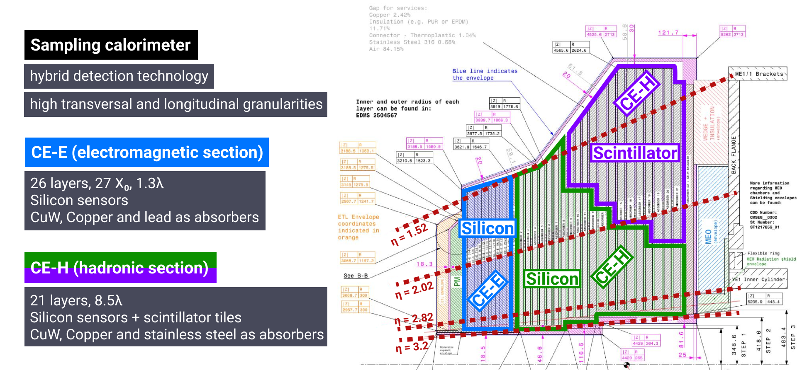
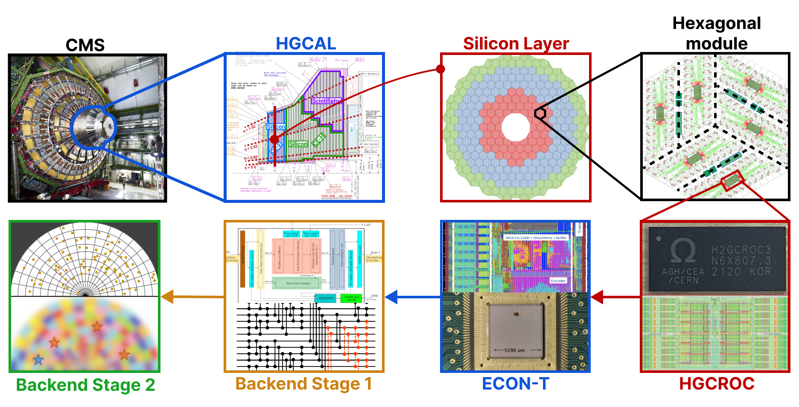
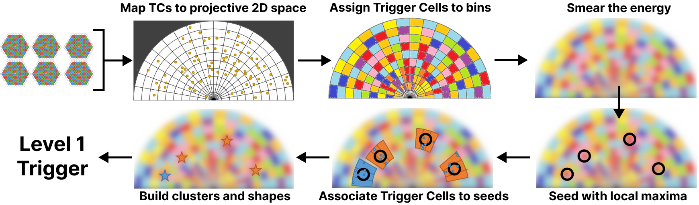
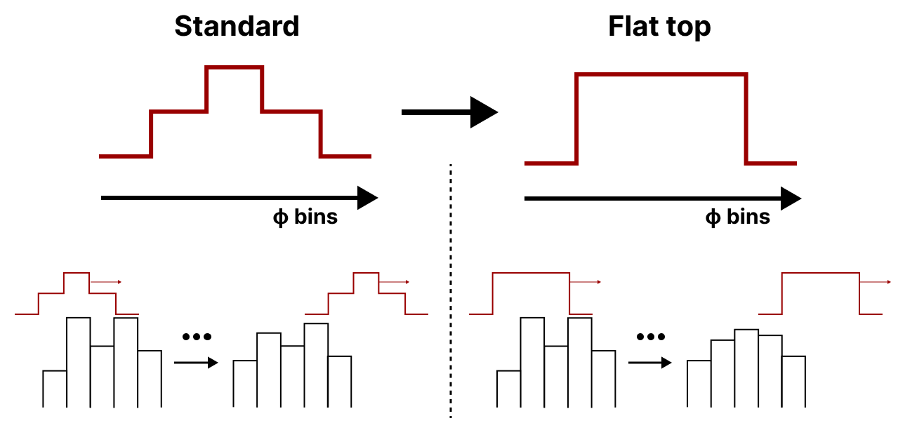
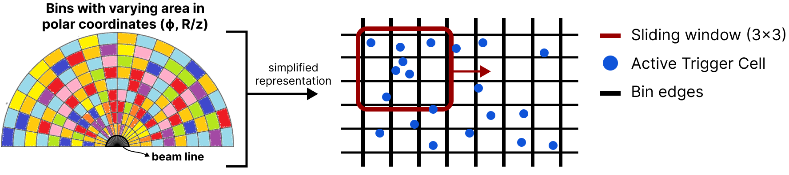
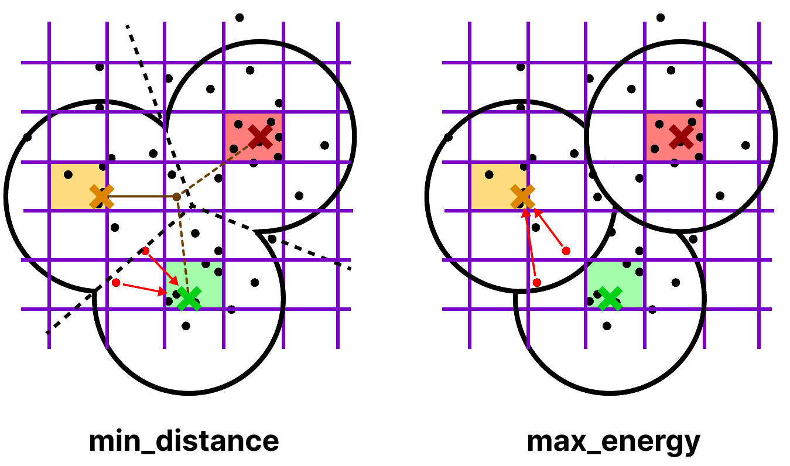

.. _reco_chain_overview:

Reconstruction Chain
********************

The framework refers to HGCAL, a novel calorimeter for the CMS High-Luminosity phase.

   Longitudinal slice of the HGCAL, which is a sampling calorimeter to be deployed in the CMS endcaps during the future High-Luminosity phase.
   It comprises two detection technologies.

Description
===========
   
The CMS HGCAL Trigger reconstruction chain is split into several steps:

   The HGCAL trigger data flow, from the on-detector electronics to Stage 2. The latter produces Trigger Primitives.

The backend Stage 2 produces Trigger Primitives, which are objects that serve as building blocks for the Level-1 Trigger decision, which decides if an event is worth keeping at 750kHz.

The layout of the Stage 2 is evolving, but can be currently summarized as follows (see also `this presentation <https://indico.jlab.org/event/459/contributions/11376/>`_):

   The Backend Stage 2, from Trigger Cells (TCs, top left) to building Trigger Primitives (TPs) to send to the Level-1 Trigger.

All the steps are implemented in separate files stored under ``tasks/``.
One can add and/or remove tasks from the chain by modifying ``scripts/run_default_chain.py`` (or other similar scripts in the same folder).
The output of every task is stored in dedicated `HDF5 <https://docs.h5py.org/en/stable/index.html>`_ files, which can be used for validation.

.. warning::
   HDF5 files are created either via the convenient ``pandas`` API or using ``h5py`` directly.
   This implies that the corresponding technologies have to be employed to read such files, and they are not exchangeable.
   A possible future improvement could be to use the same structure everywhere.

The framework often uses vectorized operations for speed-up.
A series of customisation options is available under ``config.yaml``.

Histogramming
-------------

Implemented in ``tasks/fill.py``, includes the TC mapping and assignment to a projective 2D bin space.

TCs are mapped to the (ϕ, :math:`\:\text{R}/z`) two-dimensional projective space, where the binning is customisable.
Only the needed information is stored for efficiency.
For each event, information on generated and clustered particles is stored for later validation.

Smearing
-------------

Implemented in ``tasks/smooth.py``, smears the bin energy across both dimensions.
It was originally added to mitigate cluster splits.
Given `available alternatives <https://indico.jlab.org/event/459/contributions/11376/>`_ it is not clear any longer whether it will be required.

The width of the smearing kernel is customisable.
Multiple smearing kernels are supported, and implementing additional ones is straightforward using ``--kernel``.

   Representation of two possible smearing kernels along the ϕ direction, where bins counts refer to the total TC energy.
   The "flat top" kernel assigns an equal weight to the two first neighbours (left and right) of any given bin.
   
   
Seeding
-------------

Implemented in ``tasks/seed.py``, it finds local energy maxima.
A variant using hexagonal coordinates is available in ``tasks/seed_cs.py``.

The seeding window size is customisable in both dimensions.

   Representation of the seeding step with a seeding window of size 1, which covers 9 bins.
   The window assesses whether the central bin is a seed, comparing it with its 8 neighbours.
   It then moves to the next position, with unit stride.
   
   

Clustering
-------------

Implemented in ``tasks/cluster.py``, defines the properties of clusters based on the seed and surrounding TCs.
Each seed originates one cluster.

Two algorithms are available, ``min_distance`` and ``max_energy``.
The former prioritized the distance of TCs to seeds, and the latter prioritizes the TC energy.
Both algorithms only consider TCs within a given radius.

   Representation of the two clustering algorithms currently supported.
   The three colors represent three seeds.
   The algorithms prioritize the distance between seeds and TCs, or TC energy.
   The two red arrows indicate two TCs which are associated to different seeds depending on the chosen algorithm.
   

Validation
----------

Implemented in ``tasks/validation.py``.
Some simples validation checks are performed to compare clusters reconstructed with CMSSW (and stored in the histogramming step) with clusters reconstructed with this custom framework.
